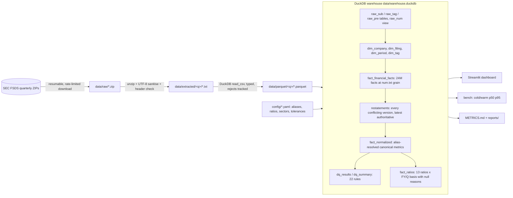
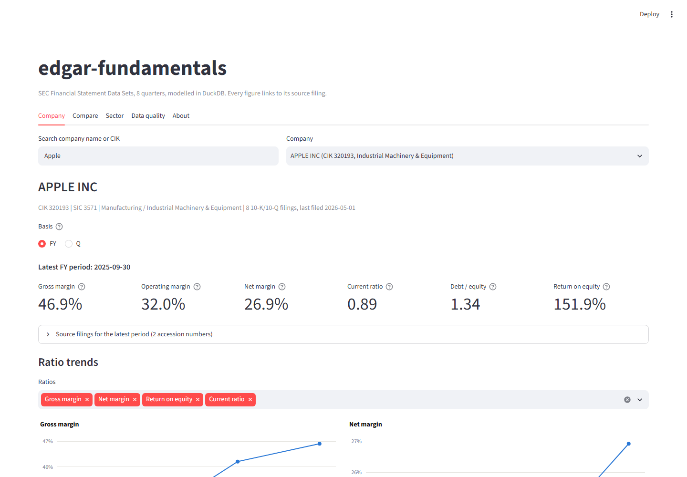
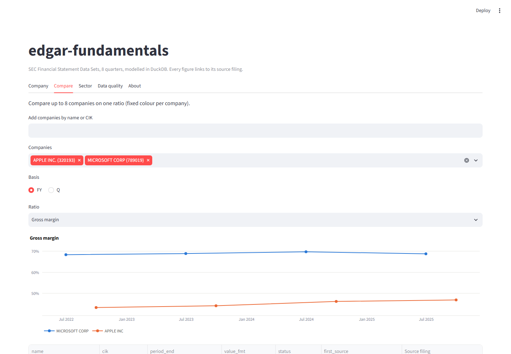
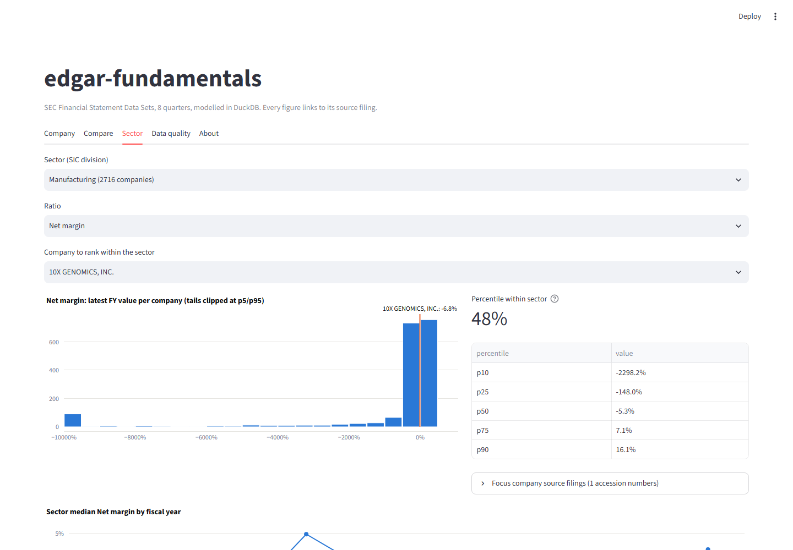
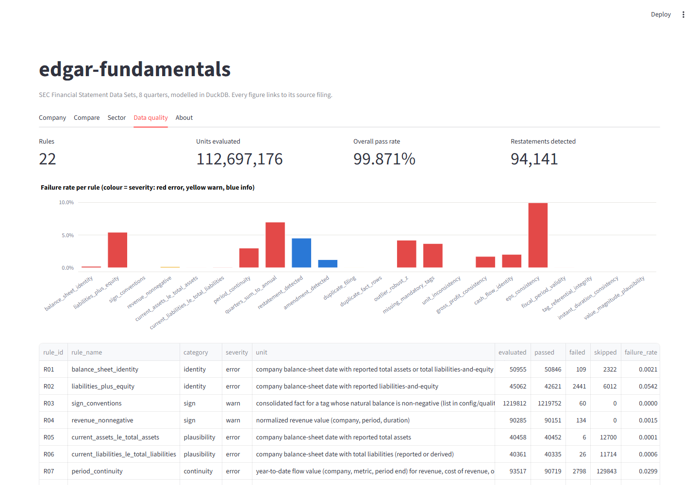

# edgar-fundamentals

A production-shaped fundamentals data platform built on the SEC's free
[Financial Statement Data Sets](https://www.sec.gov/dera/data/financial-statement-data-sets):
every numeric XBRL fact from every 10-K and 10-Q filed in the last eight quarters, ingested into a
DuckDB warehouse, validated by 22 named data-quality rules, turned into per-company ratios, and served
through a Streamlit dashboard where every figure links back to its source filing on EDGAR.

Measured numbers (rows, timings, pass rates, query latencies, coverage) live in [METRICS.md](METRICS.md);
the query-performance optimization pass (diagnosis, one change at a time, before/after with costs) is
written up in [bench/OPTIMIZATION.md](bench/OPTIMIZATION.md);
the per-rule data-quality report is in [reports/data_quality.md](reports/data_quality.md).

## Architecture



Text version of the flow: SEC ZIP -> cached download -> sanitised text -> typed Parquet staging (the
idempotency unit) -> DuckDB warehouse built with `CREATE OR REPLACE` from Parquet -> quality rules and
ratios written back into the same DuckDB file -> dashboard, benchmark and metrics read it read-only.

## Setup

Requirements: Python 3.12 (provisioned by [uv](https://docs.astral.sh/uv/)), ~8 GB free disk, network access
to sec.gov.

```bash
git clone <this repo> && cd edgar-fundamentals
cp .env.example .env          # set EDGAR_CONTACT_EMAIL: SEC requires a contact in the User-Agent
uv sync --extra dev           # creates .venv with DuckDB, Streamlit, pytest, ...

uv run edgar-fundamentals all # ingest 8 quarters -> build -> validate -> ratios -> bench -> metrics
uv run streamlit run src/edgar_fundamentals/dashboard/app.py
```

Individual stages, all idempotent:

| command | what it does |
|---|---|
| `edgar-fundamentals ingest [--quarters N] [--latest 2026q2] [--force] [--drop-extracted]` | download ZIPs (resumable, skips cached), parse to Parquet, log bytes / rows / seconds / rows-per-second per quarter into `data/manifest.json` |
| `edgar-fundamentals build` | rebuild `data/warehouse.duckdb` from Parquet (writes to `.tmp` then swaps) |
| `edgar-fundamentals validate` | run all rules in `quality/rules/*.sql`, write `reports/data_quality.md` / `.json` |
| `edgar-fundamentals ratios` | compute `fact_ratios` |
| `edgar-fundamentals bench [--cold-runs 20] [--warm-runs 50] [--out bench/results/x.json]` | time the five dashboard queries cold and warm, plus dashboard load |
| `edgar-fundamentals plans [--out bench/plans/before] [--no-bisect]` | save EXPLAIN ANALYZE plans (cold/warm) for the five queries and the company_search cold-cost bisection |
| `edgar-fundamentals metrics [--no-tests]` | run pytest with coverage and write `METRICS.md` |
| `edgar-fundamentals screenshots` | capture dashboard PNGs with Playwright (optional) |

Tests: `uv run pytest` (unit tests need no data; integration tests skip when the warehouse is absent).

## Data model

| table | grain | notes |
|---|---|---|
| `dim_company` | CIK | latest name, SIC, sector (SIC division) and industry (2-digit major group) from `config/sic_sectors.yaml`, derived fiscal-year-end month |
| `dim_filing` | accession number | form, period, filed date, filer-reported fy/fp, amendment flag, EDGAR URL |
| `dim_period` | (period end, duration in quarters) | instant vs duration, period start, calendar year/quarter |
| `dim_tag` | (tag, taxonomy version) | datatype, instant/duration, labels |
| `fact_financial_facts` | num.txt row | every numeric fact of 10-K/10-Q family filings; `is_consolidated` flags non-dimensional facts; `fiscal_year`/`fiscal_quarter` derived from the company's fiscal year end |
| `restatements` | one row per conflicting version | same (company, tag, period, duration, unit) with different values across filings; `is_authoritative` marks the latest filing; `classification` splits restatement vs rounding |
| `fact_normalized` | (company, period end, duration, canonical metric) | alias resolution from `config/aliases.yaml`; carries source accession, source tag, alias rank, restatement flag and a resolution reason; derived rows (e.g. gross profit = revenue - cost) are marked |
| `dq_results`, `dq_summary` | failure row / rule | outputs of `validate` |
| `fact_ratios` | (company, period end, basis, ratio) | value, status (`ok`, `derived`, `estimated`, `null`), explicit reason, JSON of inputs with their accession numbers |

Conventions worth knowing:

- FSDS rounds period ends to month-end, so Apple's 28 Sep 2024 year-end appears as 2024-09-30.
- Values are fully scaled (revenue 391,035,000,000, not 391,035).
- Fiscal-year label = calendar year in which the fiscal year ends. Filer-entered `fy`/`fp` are kept as
  "reported" but not trusted for comparatives.
- Q basis flows use the filed standalone quarter when present; otherwise the quarter is derived as
  YTD(n) - YTD(n-1), and Q4 as FY - 9M YTD, with status `derived_from_ytd` and both accession numbers recorded.
- Balance-sheet ratios use ending balances; quarterly ROA/ROE are unannualized.
- Only consolidated (non-dimensional) facts feed the normalized layer; multi-class-share EPS that is
  tagged purely by share class is a known v1 gap.
- Forms outside the 10-K/10-Q families (8-K, S-1, 20-F, ...) are ingested and counted but not modelled.

## Data quality

Rules are SQL files with a metadata header (`src/edgar_fundamentals/quality/rules/`). Each returns
pass/fail/skip per unit of evaluation; `skip` means the inputs were not reported, so failure rates are
computed over evaluated units only and coverage is reported separately. Tolerances live in
`config/quality_rules.yaml`. Categories: identity (balance sheet, gross profit, cash flow, liabilities+equity),
sign, plausibility (current <= total, magnitude, EPS), continuity (YTD chain, quarters vs annual),
restatement, duplicate (filings and raw rows), outlier (robust z vs company history), completeness
(mandatory metrics after alias resolution), unit, referential.

## Screenshots

Generated by `uv run edgar-fundamentals screenshots` into `docs/screenshots/` (Playwright + Chromium;
`uv run playwright install chromium` once).

| Company | Compare |
|---|---|
|  |  |

| Sector | Data quality |
|---|---|
|  |  |

## Layout

```text
config/            aliases.yaml, ratios.yaml, mandatory_tags.yaml, sic_sectors.yaml, quality_rules.yaml, settings.yaml
src/edgar_fundamentals/
  ingest/          download.py (resumable, rate-limited), load.py (Parquet staging), manifest.py
  warehouse/       runner.py, aliases.py, sql/0xx_*.sql
  quality/         registry.py, runner.py, report.py, rules/R01..R22_*.sql
  ratios/          compute.py (pure functions + table build)
  dashboard/       app.py, queries.py (the 5 benchmarked queries), components.py, screenshots.py
  bench/           run.py (harness), plans.py (EXPLAIN ANALYZE + bisection), optimization_report.py (tables for bench/OPTIMIZATION.md)
  metrics/         collect.py, METRICS.md.j2
tests/             unit tests (synthetic fixtures per rule, ratio math, loader) + integration tests on the real warehouse
```
